# Crazy Eights Online Game

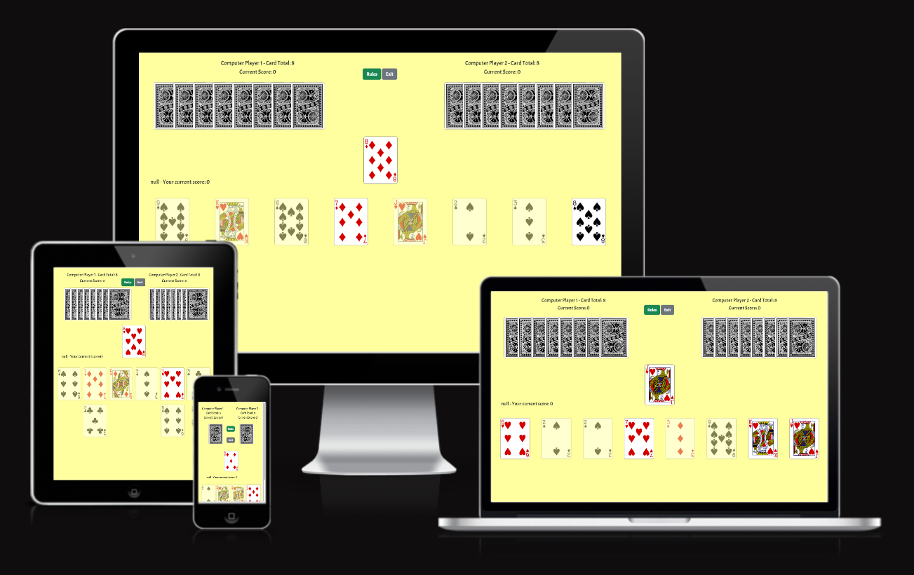

Deployed Website: [Crazy Eight's Online Game](https://danarthur99.github.io/Milestone-Project-2.Crazy-Eights-Game/)

Crazy Eights is a popular shedding style card, similar to UNO, where the goal is to be the first player to empty your hand.

The with each turn, the player must lay down a card of the same number of suit as the previous, with some cards having special rules.

## CONTENTS

* [Project Goal](#Project-Goal)

* [User Experience (UX)](#User-Experience-UX)
  * [User Stories](#User-Stories)

  * [Design](#Design)
    * [Wireframes](#Wireframes)
    * [Typography](#Typography)
    * [Colour Scheme](#Colour-Scheme)
    * [Features](#Features)
    * [Accessibility](#Accessibility)

* [Technologies Used](#Technologies-Used)
  * [Languages Used](#Languages-Used)
  * [Frameworks & Other Libraries/Programs Used](#Frameworks--Other-LibrariesPrograms-Used)

* [Deployment & Local Development](#Deployment--Local-Development)
  * [Deployment](#Deployment)
  * [Local Development](#Local-Development)
    * [Forking a Repository](#Forking-a-Repository)
    * [Cloning a Repository](#Cloning-a-Repository)

* [Testing](#Testing)
  
* [Credits](#Credits)
  * [Code](#Code)
  * [Media](#Media)

## Project Goal / Rationale

Crazy Eights was a game that I've played many many times and continue to play with my family. Any big family get togethers and party's would more often than not end up with us playing
a round (or a few) of crazy eights.

### Rules of Crazy Eights (or the version I grew up with):

* Mutiple decks of cards may be used.
* Each player starts with 8 cards
* The winner is the first player to empty their hand
* With each turn, the player must lay down a card with the game suit or value as the previous.
* If the player cannot lay down a card, they must draw a card from the deck and pass the turn to the next player
* Laying an Ace changes direction of play. If this is also an Ace of Spades, then the next player must also draw 6 cards, unless they themselves also have an Ace of Spades,
in which case the player can reverse the direction again and accumulate the number of cards the next player must pick up to 12, etc.
* Laying a 2 means the the next player must lay a 2 down, or draw 2 cards from the pile. If they were to lay another 2, this accumulates the number of cards the next player music draw to 4, etc.
* Laying a Jack skips the next player's turn.
* An 8 may be layed at any time (unless the previous player has layed down a 2 or the Ace of Spades). Once layed, the player must choose the suit that the next player must lay. This can be overridden if the next player has an 8 themselves.

It is this history and common knowledge of the game that I have which made it one of the main reasons why I decided to create an online version of this game. While some variations of the game exist online, I have yet to come across one that implements all the extra rules that we used to play (namely "Pick up 2", "Ace reverse", and the "Jack skip a go" functionalities (while the more common version of this rule is the "Queen skip" (skip card is a Queen rather than a Jack), the "Jack skip" is the version of the rule that my family and I grew up playing)). Therefore, I felt it would be a good idea to create a version of the game that implements all of these extra rules.

## User Experience (UX)

### User Stories

#### Overall Client Goals

1. To have a game that is viewable and playable on different screen sizes
2. To have a crazy eights game that is logically functional and easy to follow
3. To have an overall website that is clear and easy to navigate

#### First Time Visit Goals

1. To be able to set a user name for the game
2. To have a score incrementer that keeps track of how many rounds of the game have been won by each player
3. To be able to see the rules at any point in the game (to help first time player get to grips with the game)

#### Returning Visitor Goals

1. To make sure the game has a good and easily usable UI that makes it as easy as possible for the player to use/play
2. To have the styling and layout visually pleasing so that players don't get visually bored.
3. To have the Game functionality fully working will all rules in place, and any errors as minimal as possible

### Design

#### Wireframes

The wireframes for this site were created using [Figma](https://www.figma.com/)

##### Home Page Wireframes

###### Desktop

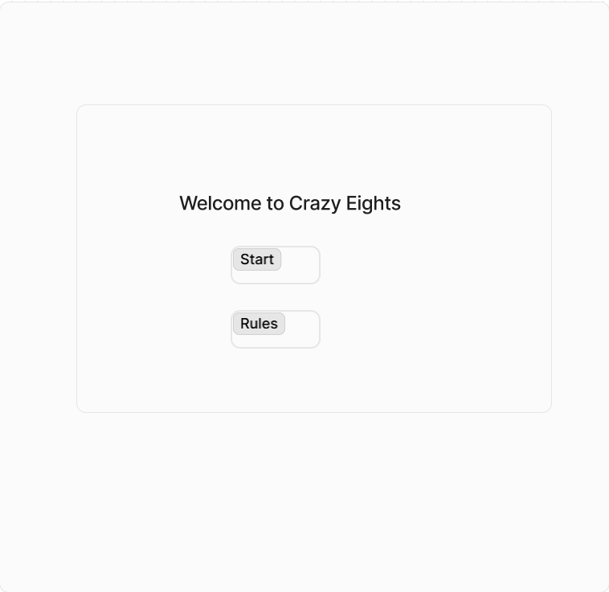

###### Mobile

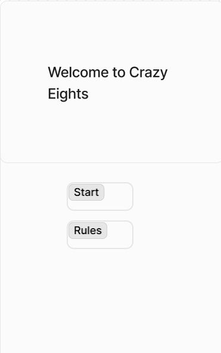

##### Game Page Wireframes

###### Desktop

###### Mobile

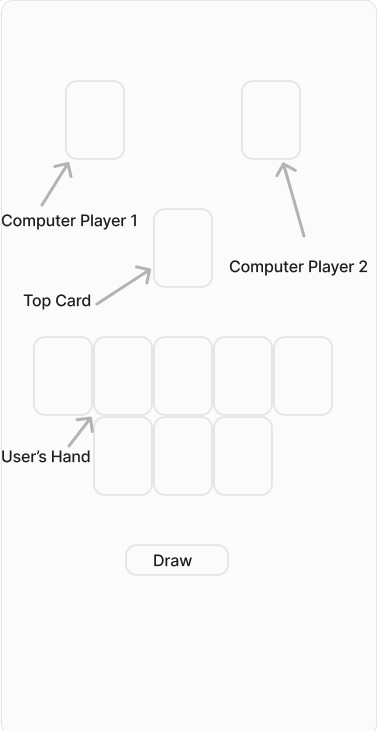

#### Typography

The Website primarily uses 2 different fonts throughout. Both of which were obtained from Google Fonts. These fonts were:

* Jersey 10 ('sans-serif')
* Acme ('sans-serif')

Jersey 10 has a very pixelated design which I thought would be a good fit for this project, hence why I decided to use it for the main headings throughout the website (namely the Home Page and the 404 Page)

"Acme" is a font I feel would be easier for users to read, while also being a slightly more interesting typeface than other sans-serif fonts, such as Arial.

#### Colour Palette

The colour palatte mostly consists of bright red-orange colours, and well as white and black. This was in part to match the colours of the playing cards, i.e. the suit colours.

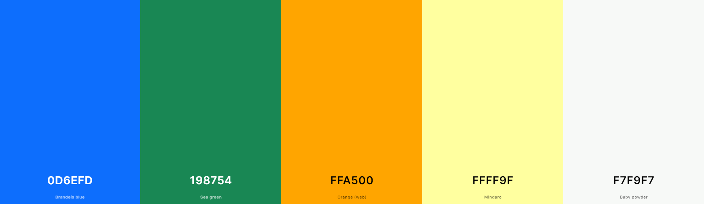

### Technologies Used

#### Languages Used

The programming languages used for this project were:

* HTML5
* CSS3
* JavaScript (used but not written by myself ([see Credits section](#Credits)))

#### Frameworks & Other Libraries/Programs Used

* Git - Version Control
* Github - To save and store changes to the project
* [Bootstrap (v5.3.2)](https://getbootstrap.com/) - CSS and JS framework used. Used mainly for the navbar, grid structure, and button styling.
* [jQuery (v3.7.1)](https://jquery.com/) - JavaScript Library used for DOM Manipulation.
* [Deck of Cards API](https://www.deckofcardsapi.com/) - API used to obtain all the data for the deck(s) of cards, including images of the cards, their value, and their suit.
* [Google Fonts](https://fonts.google.com/)- Imported selected fonts into external stylesheet, namely "Rubik Glitch" and "Exo 2."
* [Figma](https://www.figma.com/) - Used to create the wireframes.
* [Coolors](https://coolors.co/) - Used to create the colour palette images.
* [Favicon.io](https://favicon.io/) - To create favicon icons.
* [Shields.io](https://shields.io/) - Used to create badges.
* [Am I Responsive?](https://ui.dev/amiresponsive) - Used to create the multi-screen image you see at the start of this document.
* [CloudConvert](https://cloudconvert.com/webp-converter) - To convert JPEG images into WEBP format.
* [Compress-Or-Die](https://compress-or-die.com/webp) - Image File Compressor.
* Chrome Developer Tools - Used for testing features and responsiveness.
  * Lighthouse - Extension of dev tools used. Gives a score on site performance, accessibiliity, search engine optimization, and best practices in code.
* [W3C Markup Validation Service](https://validator.w3.org/) - Used for testing HTML validation.
* [W3C CSS Validation Service](https://jigsaw.w3.org/css-validator/) - Used for testing CSS validation.
* [JSHint JavaScript Code Quality Tool](https://jshint.com/) - Used for testing the quality of the JavaScript Code
* [Wave Web Accessibility Evaluation Tool](https://wave.webaim.org/extension/) - Used for testing webpage accessibility. 

### Features

#### HTML / CSS

* All Pages
  * All pages use responsive design, with different CSS and page layouts depending on the screen size.

* Home Page
  * Welcome title text saying "Welcome to Crazy Eights", along with two buttons labelled "Start New Game" and "Rules"
  * The "Start New Game" button modifies the HTML to display a text box that allows the user to enter a username.
  * The "Rules" button opens up a modal that explains the rules of the game to the user
  * The background of the of the page uses an image that displays the card suit designs in a pattern

* Game Page 
  * The cards are dealt and displayed on screen, with the user's cards at the bottom, and the computer player's hands at the top left and top right
  * The top card is displayed in the middle of the screen, with the "rules" and "exit" buttons above it
  * With each turn, text will appear to inform the user of what has happened at each turn. This is to make it easier for the user to follow the game
  * The "draw card" button is by default set to display: none, but will be set to visible if it is determined that the user has not playable cards within their hand
  * If the computer players lay down a card or draw card, their hand will visbibly change, will the max number of cards visible to the user being 8.
  This is on larger screens only, as on phone screens, only a maximum of 1 face down card will be visible to represent the computer player's hands, otherwise the layout will be alot messier on phone screens.
  * At the end of the game, a new div will appear saying who has won the game, and give the player an option to play again. If they choose to do so, then the score of whoever won will increment by 1.

  ### Going Through The Code

  #### JavaScript Features

  * Upon loading each page, and event listener on the window will listen for any errors, e.g. errors in loading images, or reading cache, etc.
  If an error is found, then the errorHandler function is called, which alters the HTML on both pages to display an error message, while also prompting the user to try and reload the page.

  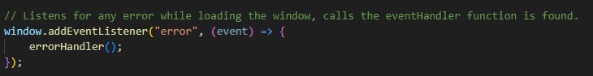
  
  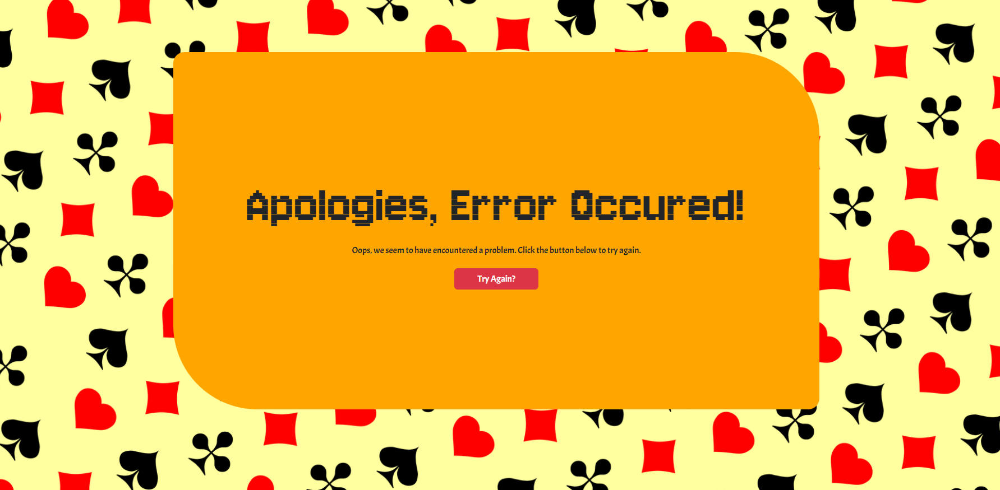
  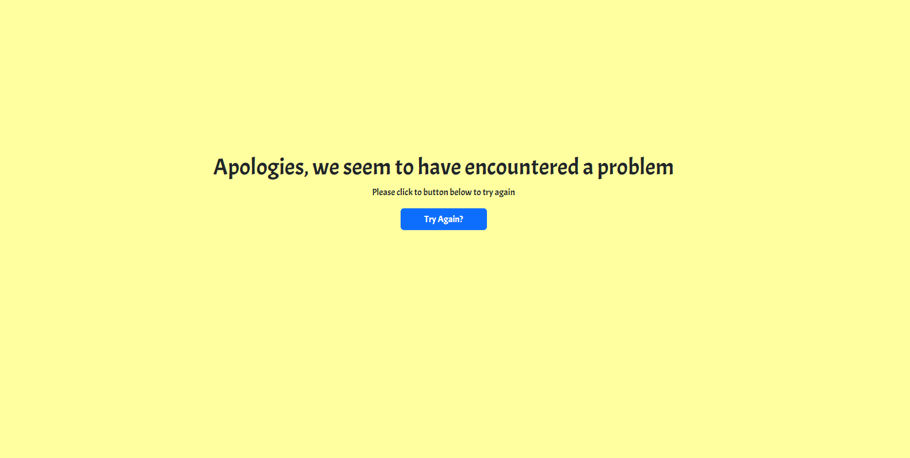

  * Once the window has been found to have no errors, an event listener attached to the document listens to see if the DOM content has been loaded.
  Once this has happened, it checks to see what page it is currently on, specifically if it is the actual game page.
  This is so it knows whether to initialize the game or not. It does this by checking the window.location.pathname, and it is a URL that ends in /game.html, then the initializeGame function is called. if not, then the homePageListeners function is called, which only sets up the event listeners for the Home Page. The reason I have done this is so that when the HTML page changes, the JavaScript doesn't try to set up event listeners for elements that don't exist in that document.

  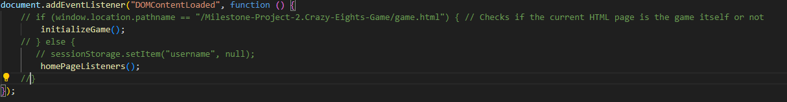

  * If it is determined it is not the game, the following function is called, which sets up the event listeners to one that change the HTML content to a username enter box, and one that stores the value of the username entered into sessionStorage, so that it can be displayed on the game.html page

  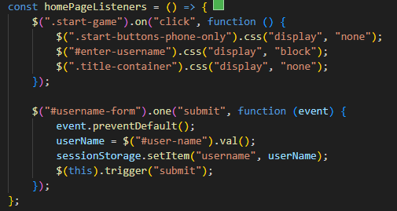

  * If it is the Game Page, then all of the event listeners are set up for that document. Once they're all set up, the startGame function is called.
  * The startGame function calls a resetAll function which resets all the object properties and other variables to their default values, as well as appending the HTML document to be in a default status, using jQuery. Once this is done. The asynchronous shuffleDeck function is called.

  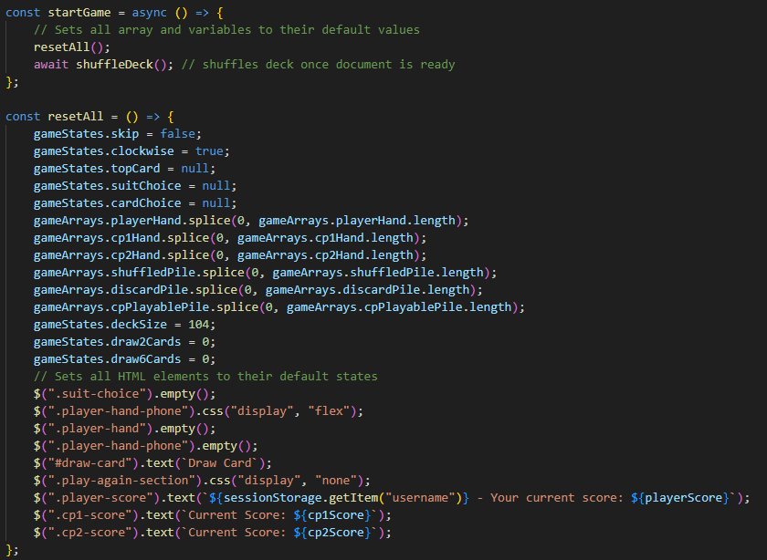

  * The shuffleDeck function fetches the deck (or decks) from the [Deck of Cards API](https://www.deckofcardsapi.com/). It then obtains the deck ID from the response JSON, before using it to draw every card from that array. Each "card" in this respone is then pushed to my own shuffledPile array within the gameArrays object. The reason I have done it this way rather than using the built in functionality within the Deck of Cards API is because it doesn't allow you to use a discard pile with more than one deck of cards, which I wanted to be able to do for this project. Once the shuffledPile array as been fully set up, The dealInitialHand function is called. I also have also included a Promise.catch which calls the errorHandler function if the API cannot be access or loaded for whatever reason.

  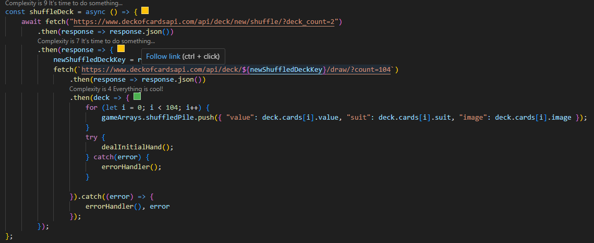

  * The dealInitialHand function deals each player their hand from the shuffledPile array, then sets the initial top card, before displaying the hand(s) on screen.

  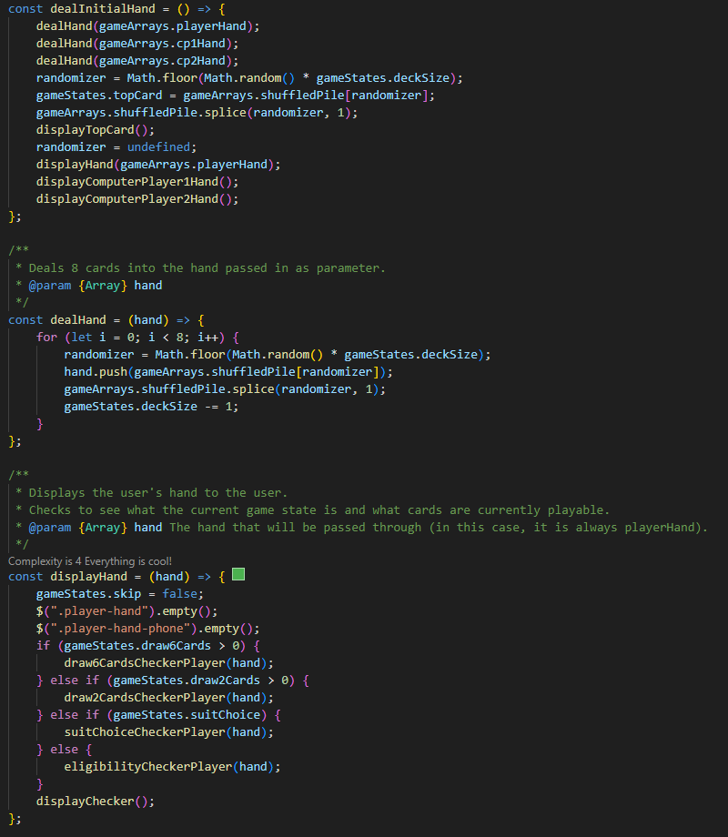

  * Within the displayHand function, there are several game state checkers which check to see what cards in the user's hand are playable depending on the current game situation. If no cards are playable, then the displayChecker function will set the "draw card" button to be visible

  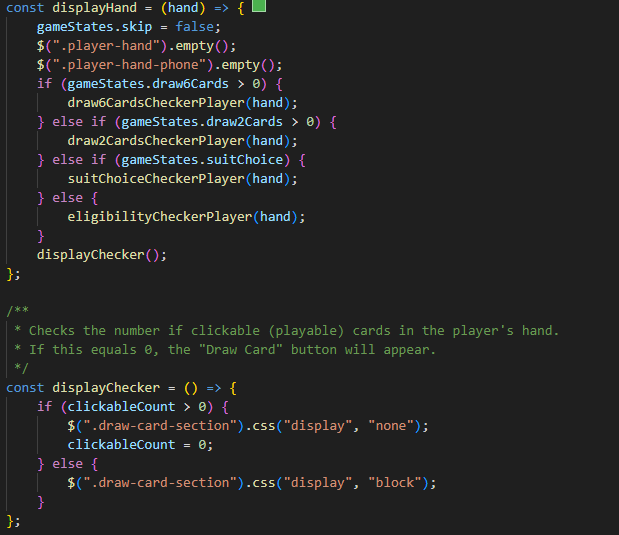

  * The displayComputerPlayer1Hand and displayComputerPlayer2Hand functions check to see how many cards are in their hands respectively, and alter the HTML to display this to user everytime they're called

  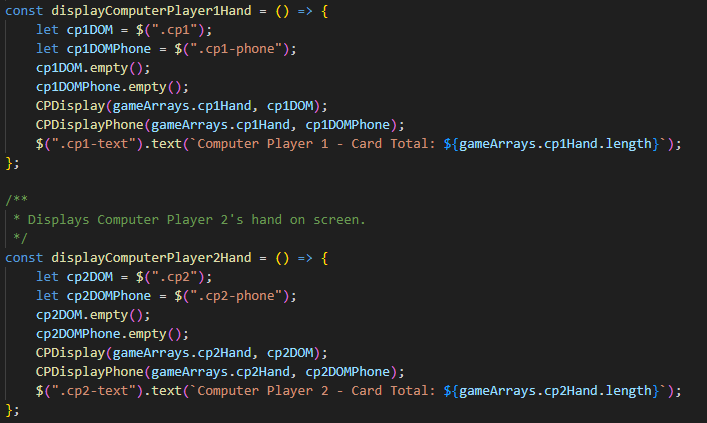

  * The cardChoiceBuffer function is called whenever the user clicks on a clickable card. It is the data-card attribute string as a parameter, and uses this to match the values within the string, with the suit and value properties of the the cards within the playerHand array, and filters the values that match into a new buffer array, before setting the first index of that array to the cardChoice property.

  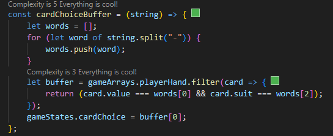

  * The addToPile function is called whenever the user confirms the card they are playing. It removes the card image in the HTML using jQuery, and also makes the "draw card" button invisible. It then pushes the current top card into the discardPile array, before setting the topCard to the value of cardChoice. The card is then removed from the user's hand and the game state variables are updated. It then checks to see if the user's hand is now empty, and if it is, it ends the game. If it isn't, it checks certain game state variable to see who's turn to call next.

  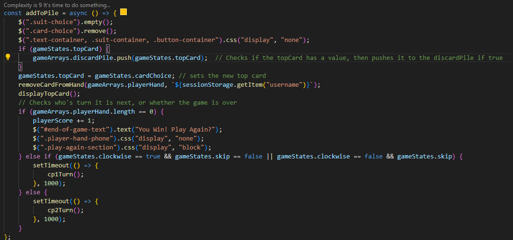

  * Each computer player has their own turn function. Within these, the game states are checked to see what cards each player can play, and the ones that can are pushed to a special cpPlayablePile array, where a random card from this array is chosen and layed. It once again checks if the hand is empty or not, and either ends the game or calls the next player's turn.

  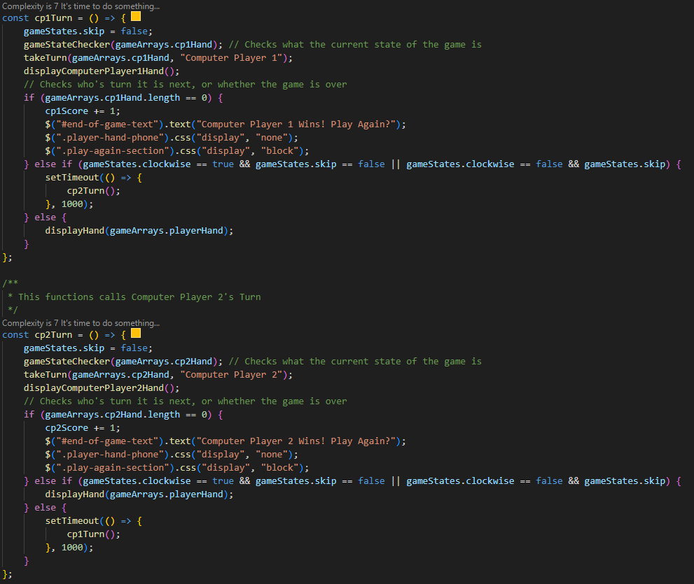

  * Whenever the drawCard function is called, it first of all checks whether the shufflePile is empty or not, then it checks the game state to see how many cards need drawing. If multiple cards need drawing, then a for loop occurs which checks the state of the shuffledPile and discardPile at each iteration. If the shuffledPile is empty, it takes whatever is the discardPile array, pushes it to the shuffledPile Array, and then empties the discardPile. If both arrays end up being empty, then outOfCards variable appends to true, and which is then checked at the end of turn, to which it will end the game if true.

  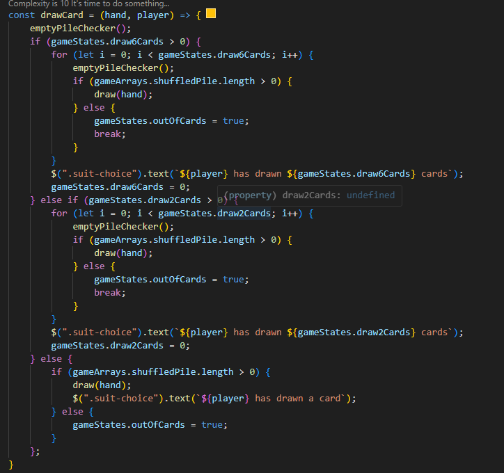

### Accessibility

* Semantic HTML has been used, i.e. the use of header, section, and footer.

* The correct alt tags are used for all img elements.

* Contrasting colours are used to make each aspect of the website easily readable and viewable

## Deployment & Local Development

### Deployment

Github Pages was used to deploy the live website. The instructions to achieve this are below:

  1. Log in or Sign Up to Github.
  2. Find the repository for this project, DanArthur99 / Milestone-Project-2.Crazy-Eights-Game.
  3. Click on the Settings link.
  4. Click on the Pages link in the left hand side navigation bar.
  5. In the Source section, choose main from the drop down select branch menu. Select Root from the drop down select   folder menu.
  6. Click Save. Your live Github Pages site is now deployed at the URL shown.

### Local Development

#### Forking a Repository

To fork the Panic Switch Website repository:

  1. Log in or Sign Up to Github.
  2. Go to the repository for this project, DanArthur99 / Milestone-Project-2.Crazy-Eights-Game.
  3. Click the Fork button in the top right corner.

#### Cloning a Repository

To clone the Panic Switch Website repository:

  1. Log in or Sign Up to GitHub.
  2. Go to the repository for this project, DanArthur99 / Milestone-Project-2.Crazy-Eights-Game.
  3. Click on the code button, select whether you would like to clone with HTTPS, SSH or GitHub CLI and copy the link shown.
  4. Open the terminal in your IDE and set your working directory to the location you want to use for the cloned repository.
  5. Type 'git clone' into the terminal window, and paste the link from step 3, then press enter.
  6. Your cloned repository should now be located in your chosen directory, ready for local development.

## Testing
Please follow the link below to the testing file:

[Testing Document](TESTING.md)

## Credits

### Code

* [Lite YouTube Embed repository](https://github.com/paulirish/lite-youtube-embed?tab=readme-ov-file) - author: paulirish
  * (This repository was used to reduce the performance issues I had when loading in the iframe on the home. The lite-youtube-embed.css and lite-youtube-embed.js files have been copied into my github repository) 
* [Image responsivity fix](https://stackoverflow.com/questions/25766783/how-to-make-my-image-responsive-width-and-height) - author: JasonK
  * (This code (accepted answer) was used to fix the responsivity issue on the cover art image load in)
* [Country list](https://gist.github.com/danrovito/977bcb97c9c2dfd3398a) - author: danrovito
  * (This code was copied into the sign-up form, and was used to display the country dropdown list)
* [Text and email input validation](https://stackoverflow.com/questions/29823591/html-input-do-not-allow-numbers) - author: Mior
  * (This code was used to add additional validation to the names and email inputs of the sign up form. This was basically so that numbers and special characters would not be accepted in the name field, and also so that the email addresses would definitely be written in the correct format, and not just any string of characters that contains an @ character)

### Other References 

* [How To Build A Simple Card Game With JavaScript](https://www.youtube.com/watch?v=NxRwIZWjLtE) - author: Web Dev Simplified
  * (Useful video explaining how )

