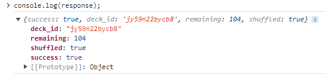
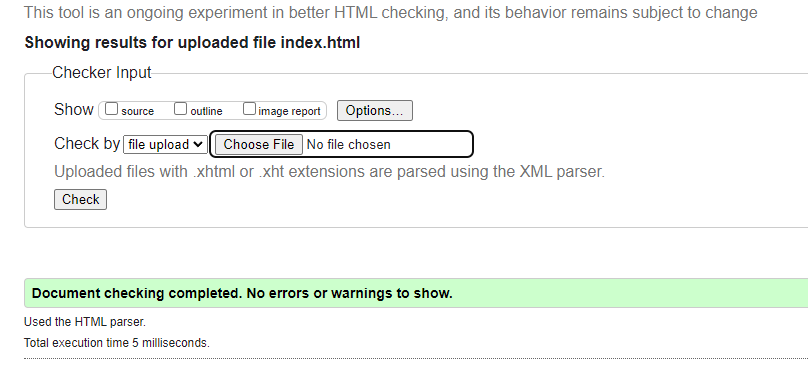
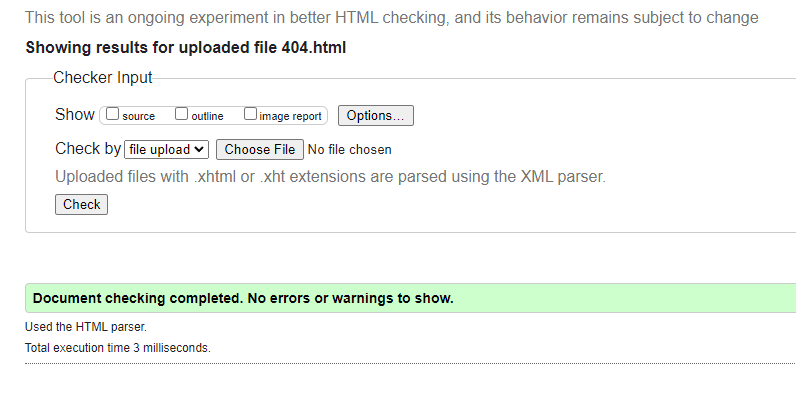
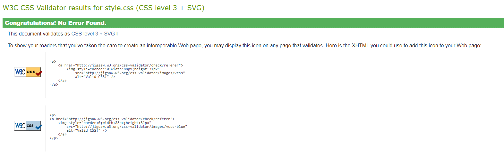

# Crazy Eights Online Game - Testing Document

## CONTENTS
* [Manual Testing](#Manual-Testing)
  * [Full Testing](#Full-Testing)
    * [Home Page Testing](#Home-Page-Testing)
    * [Game Page Testing](#Game-Page-Testing)
  * [W3C Validator](#W3C-Validator)
  * [Lighthouse Testing](#Lighthouse-Testing)
  * [Wave Accessibiliy Testing](#Wave-Accessibility-TSesting)
  * [Bugs](#Bugs)
    * [Solved Bugs](#Solved-Bugs)
  * [Testing User Stories](#Testing-User-Stories)
  * [Other Testing](#Other-Testing)
* [Automated-Testing](#Automated-Testing)

## Manual Testing

### Full Testing

The site was tested on the following systems:

* Cyberpower Ryzen 5 - OS: Windows 11 v23H2
* Samsung Galaxy A52S 5G

This was also tested on the following browsers:

* Google Chrome - Version 125.0.6422.77 (64-bit)
* Microsoft Edge - Version 125.0.2535.51 (64-bit)
* Mozilla Firefox - Version 126.0 (64-bit)

#### Home Page Testing

**Feature**|**Expected Outcome**|**Test Action**|**Result**|**Pass/Fail**
:-----:|:-----:|:-----:|:-----:|:-----:
Rules Modal Home Page|Rules modal should appear|Click Rules button|Rules modal opened|Pass
Rules Modal Home Page (Phone Size Screen)|Rules modal should appear|Click Rules button|Rules modal opened|Pass
Start Game Button Large Screens|HTML updates to username enter field|Click Start New Game button|HTML updates|Pass
Start Game Button Phone Size Screens|HTML updates to username enter field|Click Start New Game button|HTML updates|Pass
Username Empty Check|User is prompted for username|Click Start Game with empty text field|user cannot proceed|Pass
Username Not Empty Check|user is taken to the game page|Press the Start Game button with value in text field|game.html is loaded|Pass

#### Game Page Testing

**Test**|**Expected Outcome**|**Test Action**|**Result**|**Pass/Fail**
:-----:|:-----:|:-----:|:-----:|:-----:
API data fetch test |API fetches the deck data from the Deck of Cards API|Pause code and console.log(response)||Pass
Card Choice test|Displays the options to play the selected card -  yes or no|Click a clickable card|Play card button section is displayed|Pass
Card Choice - Phone Screens|Displays the play card options in a modal|Click a clickable card|Play card modal is displayed|Pass
Yes Button test|Lays the card to the pile and calls the next turn - card is removed from player's hand|Click play card? - yes|Card is played and next turn is called. Card is also removed from hand|Pass
No Button test|removes play card options|Click play card? - no|play card button section removed|Pass
Rules Button Game Page|displays the rules modal when clicked|Click Rules button|Rules modal displayed|Pass
Exit Button test|displays a modal asking if the player is sure|Click Exit button|Modal displayed|Pass
Game State text field test|displays text showing what action has just happened with each turn|take Player turn|Text updates with each turn e.g. Player lays 4 of HEARTS|Pass
Clicking an 8 Card|Displays a different set of buttons that allows the user to choose a suit as well|Clicking a card with the value of 8|Displays a 4 yes options with each suit labelled and a no button to cancel the choice|Pass
Clicking an 8 Card - Phone Screens|Displays a different modal that allows the user to choose a suit as well|Clicking a card with the value of 8|Displays a modal with  4 yes options with each suit labelled and a no button to cancel the choice|Pass
Clubs Button test|"The next player must then lay down club| or an 8"|Clicking the clubs button|The next player lays a club
Hearts Button test|The next player must then lay down heart or an 8|Clicking the hearts button|The next player lays a heart|Pass
Spades Button test|The next player must then lay down spade or an 8|Clicking the spades button|The next player lays a spade|Pass
Diamonds Button test|The next player must then lay down diamond or an 8|Clicking the diamonds button|The next player lays a diamond|Pass
Jack card functionality|Laying a Jack skips the next players go|Lay a Jack Card|The next players turn is skipped|Pass
2 Card functionality|Laying a 2 should mean the next player has to lay a 2 or draw 2 cards|Lay a 2 Card|The next player draws 2 cards|Pass
2 card accumulation functionality|If the user lays a 2 and the next player lays a 2 then cards needed to be drawn should accumulate to 4|Lay a 2 Card while the next player also has a 2|The next player after draws 4 cards. Also can add pauses to the code and console.log the gameState.draw2Cards property with each turn to see it increase by 2 each time.|Pass
Ace card functionality|Laying an Ace changes the direction of play|Lay an Ace|The direction of play inverses|Pass
Ace of Spades functionality|Laying an Ace of Spades changes the direction of play while also forcing the next player to either draw 6 cards. Or they lay an Ace of Spades themselves|Lay an Ace of Spades|The direction of play inverses and the next player draws 6 cards. Also can add a pause to the code and console.log the gameStates.draw6Cards property to see that a value has been added.|Pass
Ace of Spades accumulation functionality|If the next player also lays an Ace of Spades, then the direction of play changes again and the next player is forced to draw 12 cards|Lay an Ace of Spades while the next player also has an Ace of Spades|The direction of play changes with each turn and the user is forced to draw 12 cards|Pass
Play Again button|Once the game has ended the user is prompted to start a new game. When this is clicked the game resets|Click of Start New Game at game completion|Game resets and starts again|Pass
Score incrementation test|Once the game is over the player that has won has theyre score incremented by one. This is then displayed on their personal score on screen in the next game.|Complete Game. Click Start New Game|Winning player score increments by 1 at game completion. Winning players score is visible on Game reset.|Pass
Draw Card test|If the user cannot go then the draw card button appears. Clicking it should add a new card to their hand and display it on screen|Click the draw card button when it appears|New card appears on screen. Can pause the code to console.log the gameArrays.playerHand array to see that a new card object has been added|Pass
Draw 2 Cards receiving end - can go|If the previous player lays a 2, then the only legal card to lay would be a 2 also. The draw2Cards value should also increment by 2|Wait until the previous player lays a 2|All cards are blanked out apart from ones with value 2. Upon playing, the draw2Cards value increments to 4. This can be seen by pausing the code and logging the value to the console.|Pass
Draw 2 cards receiving end - cannot go|If the previous player lays a hand and the user does not have a 2 in their hand. Then they should be forced to draw 2 cards|Wait until the previous player lays a 2|All cards are blanked out as no legal cards. Draw 2 cards button appears|Pass
Draw Card empty shuffledPile test|if the shuffledPile is empty then the contents of the discardPile should be pushed to it and then emptied|Wait until the shuffledPile.length is 0. Then call drawCardPlayerClick() from the console.|By logging the gameArrays to the console you can see that the shuffledPile now has objects inside the array. While the discardPile is empty|Pass
Draw Card empty shuffledPile AND empty discardPile test|In the rare occurrence that both are empty the the game should end and prompt the user to start a new game|Call the drawCard function with the gameArrays.playerHand and the username string as parameters in the console, until both the discardPile and shuffledPile arrays are empty. Then call the drawCardPlayerClick function in the console.|The end of game text appears saying that we seem to be out of cards. The Start New Game button also appears|Pass

### W3C Validator

#### Home Page

#### About Page

#### Shows Page

#### Sign Up Page

#### Thank You Page

#### 404 Page

#### Stylesheet

### Lighthouse Testing

#### Home Page

* The main issue I am getting from the lighthouse test is performance issues, which is in part due to the embedded youtube video (iframe) that has to load in, as well the numerous images and animations on the page. When I originally tested the page on the lighthouse test, I was getting scores in the 30s. To fix this issue, I used code from a repository called Lite-YouTube-Embed, written by paulirish ([see Credits section](#Credits)), which allows the page to 'lazy-load' the embedded youtube video, and only loads in the iframe when the 'facade' is clicked.
* Other issues I was getting were due to image file sizes. In the end, I ended up converting all jpg images into webp format, then further compressing them so that the file sizes were not too big.

#### About Page

#### Shows Page

* The performance for the shows page is scoring slightly lower. The largest contentful paint element is in part to blame, which has a 1,300 ms load delay.

#### Sign Up Page

* The performance is showing slightly below the rest of the criteria due to the largest contentful paint element, which is the band photo background at the top of the screen.

#### Thank You Page

* The only reason the best accessibility section is scoring lower is because of the meta refresh redirect tag. This is intentional, as I wanted the user to be redirected to the homepage once 'signing up.'

#### 404 Page

### Wave Accessibility Testing

#### Home Page

  * While no errors occurred, there is an alert for a redundant link. This however is intentional, as it is my design choice to have the band logo double as a link back to the home page no matter what page the user is on (the only exceptions to this are the thank you page and the 404 page).

#### About Page

  * Once again there are alerts for redundant links. However, this is part of my design choice.

#### Shows Page

  * As before, the redundant links alerts also appear.

#### Sign Up Page

  * Same redundant links alerts as previous.

#### Thank You Page

  * As with the lighthouse testing, the only reason an error is occuring is because of the meta refresh redirect tag, which is an intentional design choice of mine, as I wanted the user to be redirected to the home page.

#### 404 Page

### Bugs

#### Solved Bugs

* At first, the navbar would wrap strangely when the screen was shrunk down below a certain size, but before it switched to the drop down menu. One of the big things that would happen is the logo would wrap above the screen so that it was invisible.

  To get around this, I programmed the dropdown nav menu to appear at my own custom breakpoint, rather than just the bootstrap provided ones. This breakpoint was slightly larger than the tradition sm breakpoint, being 631px. This meant that the nav menu would turn into a dropdown menu before any screen wrap issue could occur

  These custom breakpoints were also used for other elements, and were implemented using the "d-custom-none" and "d-custom-maxwidth-none" class names.

* Another bug I encountered was that the text for the nav elements would go outside the lines of their containers when the screen shrunk to a certain size. 

  To fix this, I created a couple of extra media queries that would cause the font-size of the text to reduce at these specific breakpoints.

* One bug I encountered when the site was deployed was that a 405 method not allowed error would occur when attempting to submit the form, rather than taking me to the intended thank-you.html. To counteract this, I removed the method="post" attribute from the form element, and kept the action attribute value as thank-you.html, which then allowed me to submit the form and take the user to the thank you page without any issues.

* After setting the width and height attributes on the "Vanquish" cover image, the image would warp its shape when the screen shrunk down below a certain size, rather than shrinking in size and keeping the same dimensions. 

  To fix this, I found a short line of CSS code from Stack Overflow that kept the img element width at 100%, while setting the height to auto. This resolved the issue. (see [credits section](#Credits))

### Testing User Stories

#### Client Goals

1. The website uses responsive design, and has been adapted for both mobile and desktop screens.

Desktop:

Mobile:

2. Lots of themes and styling have been added to make the website look appealing to visitors. This includes different eye catching font styles, such as Rubik Glitch, and use of animations, i.e. fade-ins and slide-ins, as well as hover animations for buttons and other clickable icons.

3. Each page has its own navbar that allows the user to navigate to any page no matter what page they are currently on, making it a very easy website to navigate. The only places this doesn't neccessarily apply are the Thank You page and the 404 page, which uses a redirect and a designated Home button respectively.

#### First Time Visit Goals

1. The Website has its own "Music" section where users can see the music video for our song "Lethal Intent", and it also provides links to our Spotify page, as well as the Amazon Store.

2. There is a designated "Shows" page intended for displaying our upcoming show schedule, as well being to see our previous shows.

3. Each page provides social media links within their respective footer elements. 

#### Returning Visitor Goals

1. The top part of our home page is used to display the very latest big news about the band. For example, it currently displays a short "ad" about our latest upcoming song.
2. The "Shows" page is intended to display our upcoming shows, with the intention being to have links on these shows that take the user to a page where they can purchase a ticket (or tickets). However, since we have no current shows scheduled in, I could not implement this specific part just yet.
3. I have added a sign up page that allows the user to sign to a (as of yet) nonexistent newsletter, so that they can have the latest updates on shows, new music, merch, etc. Only the front-end aspect is currently functional, and upon submitting the form, the user is taken to a Thank You page before being redirected back to the Home Page

### Other Testing

* The website has been tested on several browsers, specifically Microsoft Edge, Google Chrome, and Mozilla Firefox, and is fully functional and working as intended on all 3.
* Each nav link has been tested on each page that they go to the intended destination page.
* Validation testing was performed on the sign up form, below is an outline of the the different tests done:

  Empty Field Testing:

  * Tried to submit the form with an empty first name field:
    * Intended result: Unable to submit form
    * Test result: Pass
  * Tried to submit the form with an empty last name field:
    * Intended result: Unable to submit form
    * Test result: Pass
  * Tried to submit the form with an empty email field:
    * Intended result: Unable to submit form
    * Test result: Pass
  * Tried to submit the form with an unselected country field:
    * Intended result: Unable to submit form
    * Test result: Pass

  Input Type Testing:

  * Tried to submit form with numbers and special characters in first name field:
    * Intended result: Unable to submit form
    * Test result: Fail
    * Fix: added the attribute pattern="[a-zA-Z]*" to the input element. ([see Credits Section](#Credits))
    * Re-test result: Pass
  * Tried to submit form with numbers and special characters in last name field:
    * Intended result: Unable to submit form
    * Test result: Fail
    * Fix: added the attribute pattern="[a-zA-Z]*" to the input element. ([see Credits Section](#Credits))
    * Re-test result: Pass
  * Tried to submit form with incorrect email format (without @) in email field:
    * Intended result: Unable to submit form
    * Test result: Pass
  * Tried to submit form with incorrect email format (with @) in email field:
    * Intended result: Unable to submit form
    * Test result: Fail
    * Fix: added the attribute pattern="[^@]+@[^@]+\.[a-zA-Z]{2,6}" to the input element. ([see Credits Section](#Credits))
    * Re-test result: Pass